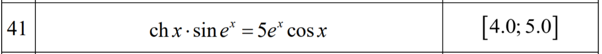

# algorithms_and_calculation_methods
Two laboratory works on the subject Algorithms and calculation methods

## lab1 Nonlinear equations with one unknown

**Formulation of the problem**
1. Develop a program that will work in windowed mode and implement the given methods for solving nonlinear equations. The developed program should display all intermediate results.
2. With the help of the developed program according to claim 1, solve the given equations on the given interval with the accuracy ε ≤ 10 ^ (- 7).
3. When performing the task according to item 2, it is necessary to plot the dependence of the approximate value of the root of the equation on the number of iterations starting from the initial approximation. If the equation has more than two roots, then plot for any two roots.

**Methods:**
1. The method of division in half
2. Steffensen method

**Equation:**

## lab2 Direct methods for solving systems of linear algebraic equations and calculation of the inverse matrix

**Formulation of the problem**
1. Solve the first system of linear algebraic equations by a given direct method
2. Solve the second symmetric system of linear algebraic equations by the method of square roots (Kholetsky method) and any other direct method.
3. Solve the third tape system of linear algebraic equations by the run method and any other direct method and find det A using the formula that follows from the run method
4. Perform items 1-3 in the window mode in the Python programming language. It is not allowed to use special functions for processing matrices and vectors when implementing the set tasks, ie it is necessary to implement SLAR solutions by coordinate calculations.
5. When performing the tasks formulated in item 4 to measure the running time of algorithms for each development environment.
6. When solving the problems set out in item 4, it is necessary to display all intermediate calculations.

**Methods:**
1. Gaussian method with the choice of the main element by columns
2. Reflection method based on QR-factorization
